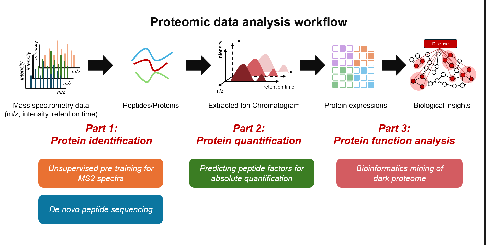

# &#128515; About me
Hi! I am currently a Ph.D. candidate at [Tsinghua University](https://life.tsinghua.edu.cn/), under the supervision of Prof. [Fuchu He](https://pi-hub.org.cn/news/show_who_scientific_info/91) / Prof. [Cheng Chang](https://i-share.ncpsb.org.cn/genee/post/167). Prior to this, I obtained my bachelor's degree from [Sun Yat-sen University](https://lifesciences.sysu.edu.cn/). Currently, I am focusing on developing AI-driven methods to transform mass spectrometry-based proteomic data into biological discovery.  

# &#128073; Research Interests

Mass spectrometry (MS) data form the foundation of proteomic analysis. My research focus on developing deep learning algorithms to analysis MS data and applying them to extract biological insights from dark proteome. This includes three interconnected directions: 
&#128293;__Part 1: Sequences Decoding__ 
Converting MS/MS spectra into peptide sequences is the cornerstone of proteomics. We focus on: (1) Unsupervised learning methods to decode spectral patterns; (2) De novo sequencing strategies for database-independent peptide identification. 
Relevant paper: [π-PrimeNovo](https://www.nature.com/articles/s41467-024-55021-3), [π-HelixNovo](https://academic.oup.com/bib/article/25/2/bbae021/7604886). 
&#128293;__Part 2: Precision Quantification__ 
Protein quantification suffers from technical biases introduced during digestion, chromatography, and MS detection. We’re building deep learning tools to correct these systematic biases and achieve true quantitative accuracy. 
Relevant paper: [LFAQ](https://pubs.acs.org/doi/10.1021/acs.analchem.8b03267). 
&#128293;__Part 3: "Dark Proteome" Exploration__ 
Much proteomic data remains uncharted—a "dark matter" part likely rich with undiscovered biological insights. Based on our algorithms, we’re systematically exploring mutations, PTMs, ncORFs, and other cryptic features hiding within this space. 
Relevant paper: [PTM](https://www.nature.com/articles/nbt.3287), [ncORFs](https://www.nature.com/articles/nrm.2017.58). 
&#10024;__Let’s collaborate__ 
I’m always happy to discuss new ideas and collaborate on algorithoms solving proteomic data challenges. Most importantly, we’re eager to collaborate with biologists to tackle complex biological questions for fresh insights. Reach out anytime!  
 
&#9193;Last update: July 2025
