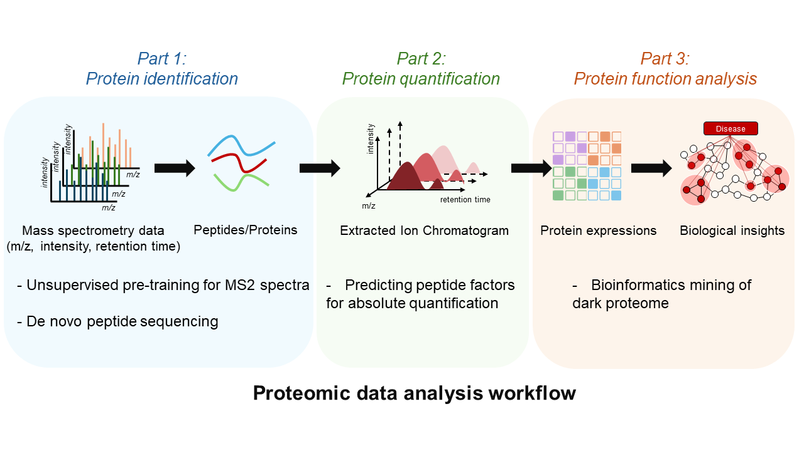

---
permalink: /
title: ""
author_profile: true
redirect_from: 
  - /about/
  - /about.html
---
# &#128515; About me
I am currently a Ph.D. candidate at [Tsinghua University](https://life.tsinghua.edu.cn/), supervised by Prof. [Cheng Chang](https://orcid.org/0000-0002-0361-2438)/[Fuchu He](https://pi-hub.org.cn/news/show_who_scientific_info/91). I obtained my bachelor's degree from [Sun Yat-sen University](https://lifesciences.sysu.edu.cn/). Currently, I am focusing on the fields of deep learning and bioinformatics, especially on decoding mass spectrometry-based proteomic data.  

# &#128073; Research Interests

Mass spectrometry (MS) data form the foundation of proteomic analysis. My research develops deep learning algorithms to analysis MS data and applies them for extracting biological insights from dark proteome. This includes three interconnected directions: 
&#128309;__Part 1: Sequences Decoding__ 
Converting MS/MS spectra into peptide sequences is the cornerstone of proteomics. We focus on: (1) Unsupervised learning methods to decode spectral patterns; (2) De novo sequencing strategies for database-independent peptide identification. 
Relevant paper: [Π-PrimeNovo](https://www.nature.com/articles/s41467-024-55021-3), [Π-HelixNovo](https://academic.oup.com/bib/article/25/2/bbae021/7604886). 
&#128309;__Part 2: Precision Quantification__ 
Protein quantification suffers from technical biases introduced during digestion, chromatography, and MS detection. We’re building deep learning tools to correct these systematic biases and achieve true quantitative accuracy. 
Relevant paper: [LFAQ](https://pubs.acs.org/doi/10.1021/acs.analchem.8b03267). 
&#128309;__Part 3: "Dark Proteome" exploration__ 
Much proteomic data remains uncharted—a "dark matter" part likely rich with undiscovered biological insights. Based on our algorithms, we’re systematically exploring mutations, PTMs, ncORFs, and other cryptic features hiding within this space. 
Relevant paper: [PTM](https://www.nature.com/articles/nbt.3287), [ncORFs](https://www.nature.com/articles/nrm.2017.58). 
# Let’s collaborate!
I’m always happy to discuss new ideas and collaborate on algorithoms solving proteomic data challenges. Most importantly, we’re eager to partner with biologists wrestling with complex biological questions—let’s combine your domain expertise with our tools to uncover fresh insights! &#10024;

# &#128266; News
- __June 2025__: I present Π-DeepLaM (a deep learning-based strategy for lactylation identification) at 73rd ASMS conference and receive [ASMS 2025 Graduate Student Award](https://asms.org/about-asms-awards/student-travel-awards), especially as the only recipient from a Chinese university! [Photo](../images/asms_award.png) 
- __September 2024 & January 2025__: I simultaneously win the first-class scholarship for graduate students from Tsinghua University and the National Center for Protein Sciences (Beijing), which is an incredible honor  and a great encouragement to me! 
- __January 2025__: Our non-autoregressive denovo sequencing model [Π-PrimeNovo](https://rdcu.be/d5o3G) is published in __Nature Communications__! 
- __June 2024__: I present Π-SPECFormer (a pre-trained model for mass spectrometry-based proteomic data) at 72nd ASMS conference! 
- __February 2024__: Our denovo sequencing model based on "complementary spectrum" [Π-HelixNovo](https://academic.oup.com/bib/article/25/2/bbae021/7604886) is published in __Briefings in Bioinformatics__! 
- __March 2023__: I come to Pengcheng Laboratory (Shenzhen) for internship and cooperation, focusing on research of self-supervising learning methods for mass spectrometry data.
- __March 2021__: I join Helab to start my research.  

&#9193;__Last update__: July 2025
