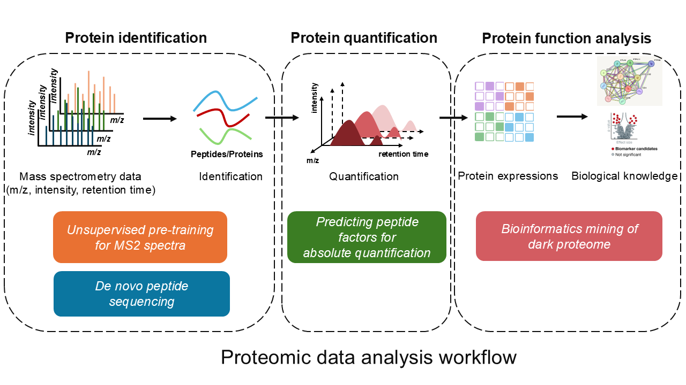

# &#128515; About me
I am currently a Ph.D. candidate at [Tsinghua University](https://life.tsinghua.edu.cn/), supervised by Prof. [Cheng Chang](https://orcid.org/0000-0002-0361-2438)/[Fuchu He](https://pi-hub.org.cn/news/show_who_scientific_info/91). I obtained my bachelor's degree from [Sun Yat-sen University](https://lifesciences.sysu.edu.cn/). Currently, I am focusing on the fields of deep learning and bioinformatics, especially on decoding mass spectrometry-based proteomic data.  
&#128293;If you are interested in what we are doing, don’t hesitate to send me an email—any discussion or cooperation is very welcome.
# &#128073; Research Interests
## Overview

## Details
Mass spectrometry data serve as both the starting point and the fundamental unit for proteomic data analysis. My research focuses on developing deep learning-based algorithms to explore mass spectrometry-based proteomic data. Meanwhile, we are also exploring the application of these algorithms for the study of dark proteome. These efforts include: 
&#128309; Unsupervised learning methods to decode complex patterns in tandem mass spectra. 
&#128309; Algorithms for de novo sequencing identification in tandem mass spectra. 
&#128309; Algorithms designed to correct absolute protein quantification by predicting peptide biases during enzymatic digestion, liquid chromatography and in a mass spectrometer. 
&#128309; Comprehensive bioinformatics mining of unannotated components of proteomic data, systematically exploring mutation, alternative splicing, PTMs and non-canonical small proteins. 
# &#128266; News
- __June 2025__: I present Π-DeepLaM (a deep learning-based strategy for lactylation identification) at 73rd ASMS conference!
- __April 2025__: I am very excited to receive [ASMS 2025 Graduate Student Award](https://asms.org/about-asms-awards/student-travel-awards), especially as the only recipient from a Chinese university! [Photo](../images/asms_award.png) 
- __September 2024 & January 2025__: I simultaneously win the first-class scholarship for graduate students from Tsinghua University and the National Center for Protein Sciences (Beijing), which is an incredible honor  and a great encouragement to me! 
- __January 2025__: Our non-autoregressive denovo sequencing model [Π-PrimeNovo](https://rdcu.be/d5o3G) is published in __Nature Communications__! 
- __June 2024__: I present Π-SPECFormer (a pre-trained model for mass spectrometry-based proteomic data) at 72nd ASMS conference! 
- __February 2024__: Our denovo sequencing model based on "complementary spectrum" [Π-HelixNovo](https://academic.oup.com/bib/article/25/2/bbae021/7604886) is published in __Briefings in Bioinformatics__! 
- __March 2023__: I come to Pengcheng Laboratory (Shenzhen) for internship and cooperation, focusing on research of self-supervising learning methods for mass spectrometry data.
- __March 2021__: I join Helab to start my research.  
